# Archived Meeseeks Box Main Screens

This document identifies the primary top-level screens currently used in the product shell and provides screenshots plus usage notes for downstream UI design work.

Status note:

- Archived on 2026-05-02.
- This is a dated March 2026 audit of the desktop/responsive product shell.
- It is preserved for historical desktop-shell evidence because the desktop app may remain a valid future surface.
- It is not active implementation, QA, or current mobile design guidance.
- Current production mobile is the black/green `/mobile` shell implemented in `app/mobile/page.tsx` and `components/mobile/*`.
- Do not use the mobile screenshots in this archive to validate or recreate the current iPhone experience.

Capture context:

- App captured from `http://127.0.0.1:3001/` on March 22, 2026.
- Focus is limited to the main, currently used top-level screens.
- Excluded from scope: `ClawTower`, `OpenClaw`, internal reference folders, hidden/in-progress routes, and drill-down detail pages unless needed for nuance.

## Shared Shell Patterns

At the time of capture, the app used the same route set on laptop and mobile rather than separate device-specific screens. That is no longer the full mobile truth.

- Desktop pattern: persistent left sidebar with branding, search, primary nav, and settings/operator footer.
- Mobile pattern: fixed top header with page title plus search/more controls, and a fixed bottom nav with `Home`, `Work`, `Chat`, `Inbox`, and `More`.
- Current mobile exception: the supported phone-first route is `/mobile`, with `command`, `jobs`, and `context` tabs and direct `/api/mobile/chat` responses.
- Information architecture pattern: the first four screens are operational entry points; the rest are supporting system surfaces.
- Interaction pattern: most list items drill into canonical objects such as work items, schedules, runs, conversations, or artifact families.
- Important nuance: in the captured headless-Chrome desktop screenshots, the mobile bottom bar also appears at the bottom of wide layouts. Treat that as a current implementation detail to validate, not an intentional design requirement.

## 1. Home

Purpose: the operational pulse screen.

How it is used:

- Gives a high-level summary of what needs review, what is in progress, what is failed or blocked, and what is coming next.
- Serves as a triage entry point rather than a place to do work directly.
- Every surfaced item is a jump point into the real underlying object.

Important nuance:

- Home is intentionally not an org chart or system map. It is optimized around intervention and monitoring.
- The quick links at the top reinforce the three most active next actions: `Work`, `Chat`, and `Inbox`.

Desktop:

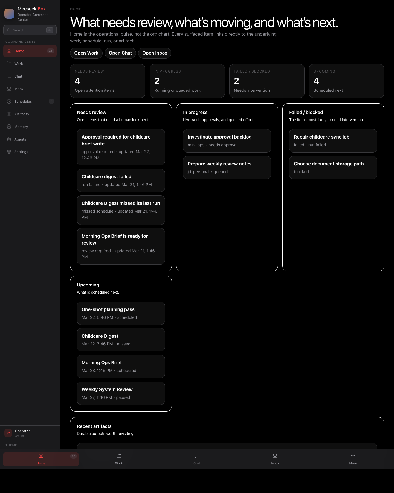

Mobile:

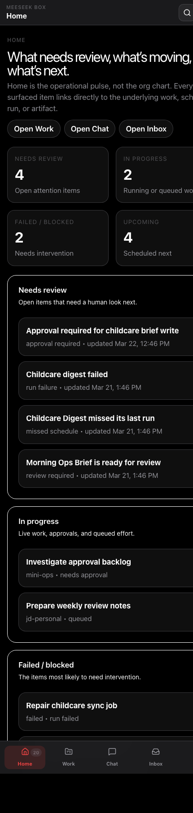

## 2. Work

Purpose: the primary operating surface.

How it is used:

- Operators create new work here in the correct runtime context and agent context.
- The board organizes active work by lane such as `queued`, `running`, `needs approval`, `blocked`, and `failed`.
- The same route also contains `Drafts` and `Jobs`, which extend the screen into planning and recurring-work setup.

Important nuance:

- `Work` is more than a kanban board. It is also the creation surface for launching tasks now, scheduling them, or saving them as drafts.
- `Jobs` is not the same thing as `Schedules`: jobs are reusable recurring templates, while schedules are the active canonical schedule records.
- This is the screen most likely to anchor future laptop-heavy workflow design.

Desktop:

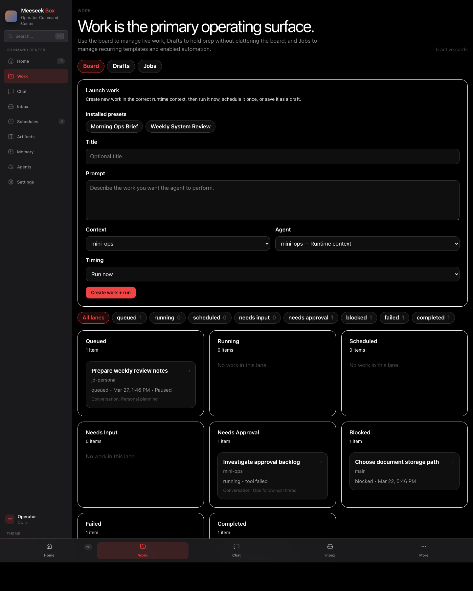

Mobile:

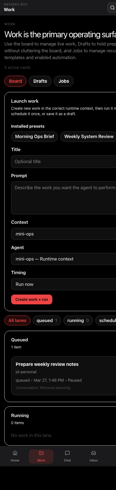

## 3. Chat

Purpose: conversational intake and coordination.

How it is used:

- Users start a new conversation by choosing runtime context and agent first.
- Users continue existing threads from the recent conversation list.
- Threads can later be promoted into tracked work when they deserve operational follow-through.

Important nuance:

- The product’s mental model is explicitly “chat first, work second.”
- Chat is not treated like a disposable assistant surface; it is a structured upstream source for operational work.

Desktop:

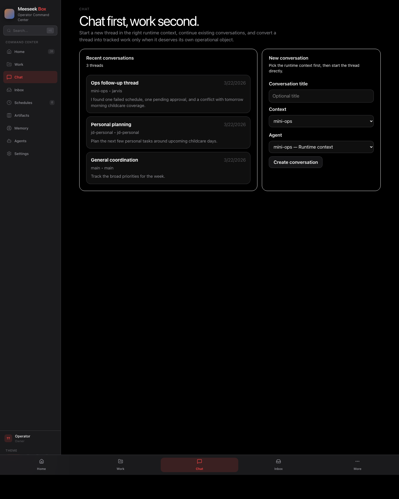

Mobile:

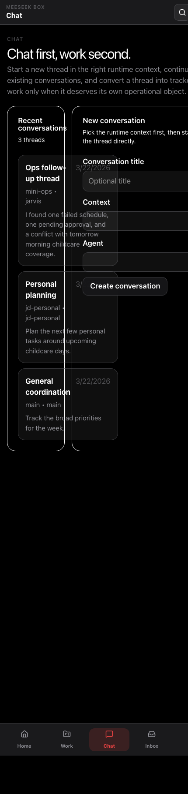

## 4. Inbox

Purpose: intervention queue.

How it is used:

- Operators come here when they want action rather than browsing.
- The screen filters attention items into `All`, `Approvals`, `Failures`, `Schedules`, and `Resolved`.
- Some items, especially approvals, can be acted on inline without leaving the page.

Important nuance:

- Inbox is not a general notifications feed. It is intentionally narrowed to items that require human review or resolution.
- This route is likely the best reference for any future “urgent operational state” design work.

Desktop:

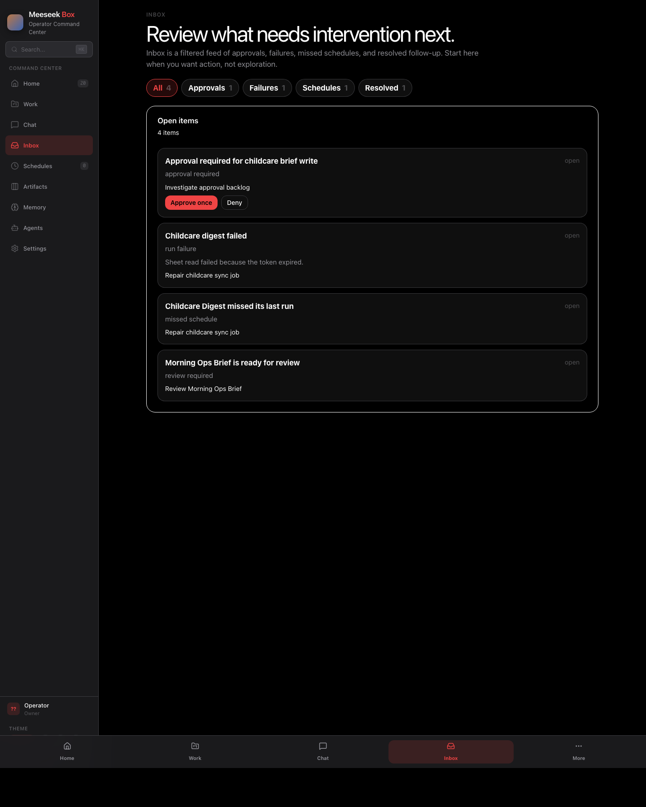

Mobile:

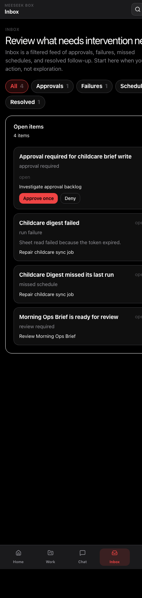

## 5. Schedules

Purpose: canonical automation surface.

How it is used:

- Shows active recurring jobs and one-shot scheduled work in one place.
- Helps operators understand cadence, next run time, status, and runtime sync state.
- Includes a refresh/reconcile action from the runtime.

Important nuance:

- This screen is the canonical schedule layer, not a legacy cron log.
- It focuses on schedule health and runtime synchronization, which makes it distinct from job-template configuration inside `Work`.

Desktop:

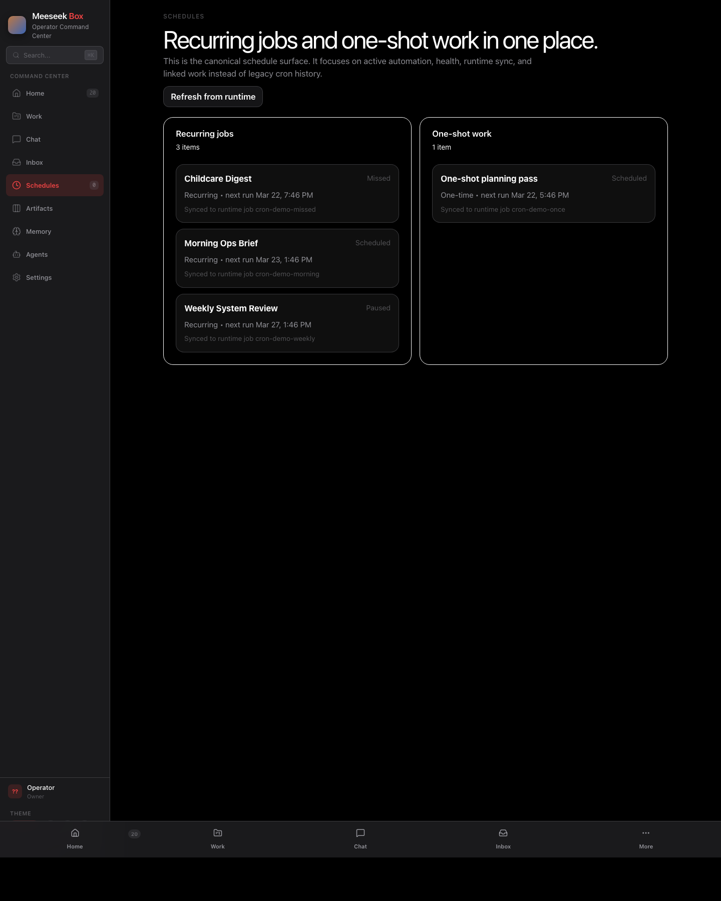

Mobile:

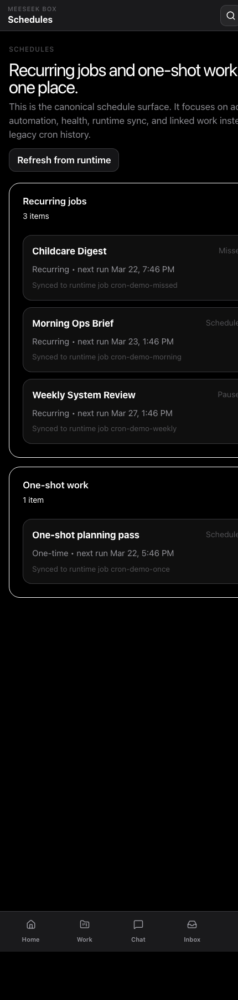

## 6. Artifacts

Purpose: output registry.

How it is used:

- Groups repeated outputs into stable artifact families.
- Tracks immutable versions under each family.
- Gives users a system-level view of output history rather than a loose file listing.

Important nuance:

- This is not framed as a generic documents/files area.
- The copy and structure emphasize producer contracts and versioned output lineage, which matters for design language and terminology.

Desktop:

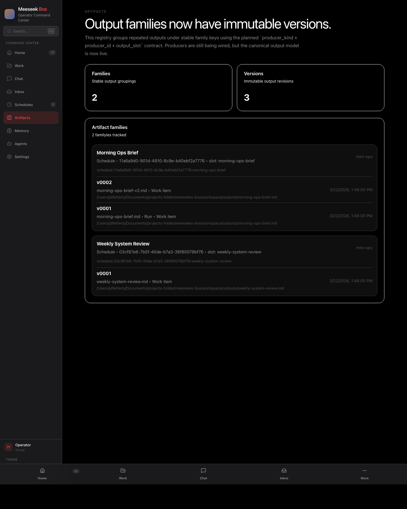

Mobile:

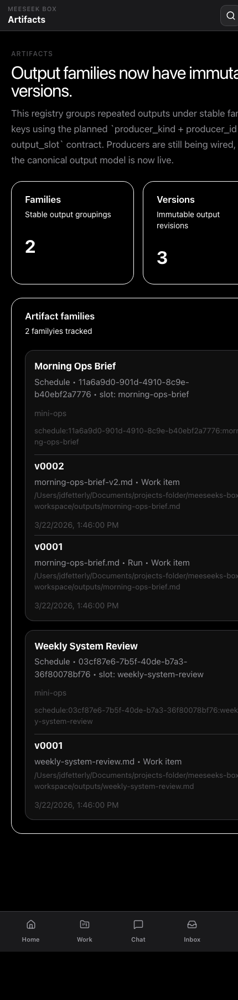

## 7. Memory

Purpose: governed memory registry.

How it is used:

- Shows active and archived memory entries plus provenance/source counts.
- Lets operators bootstrap the workspace memory area, write new entries, archive entries, and supersede outdated ones.
- Acts as the canonical UI layer over OpenClaw-compatible workspace memory files.

Important nuance:

- Archive is metadata-only and does not delete the underlying file.
- This is intentionally not just a file browser; it is a governance and lifecycle surface for memory records.

Desktop:

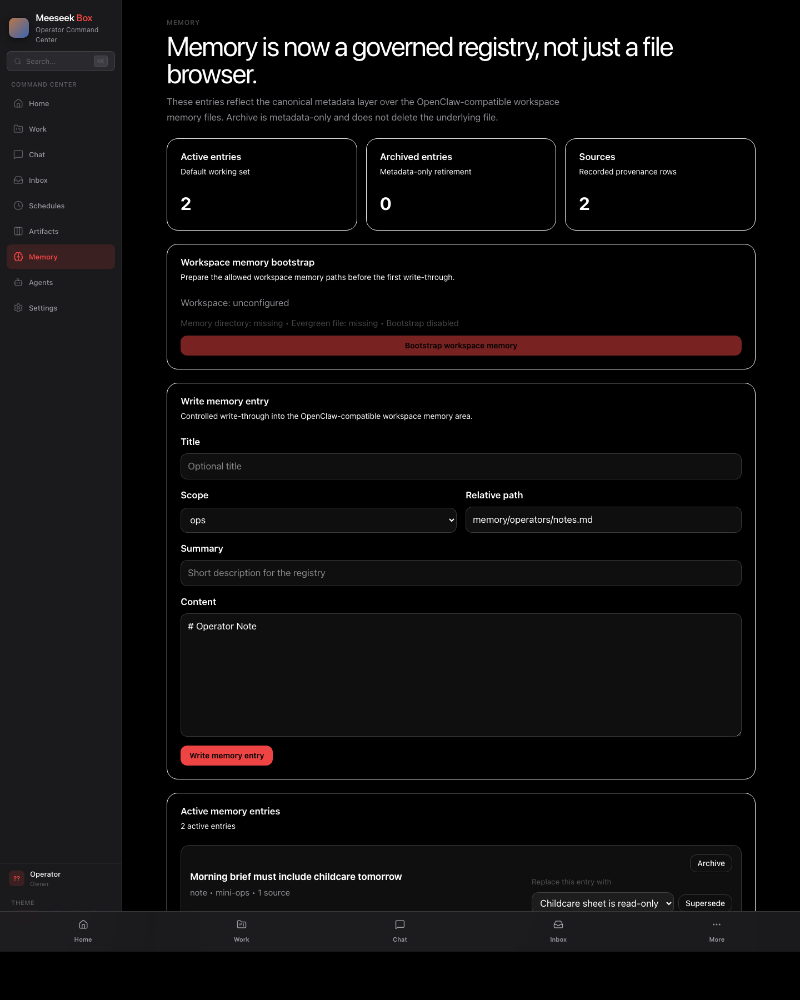

Mobile:

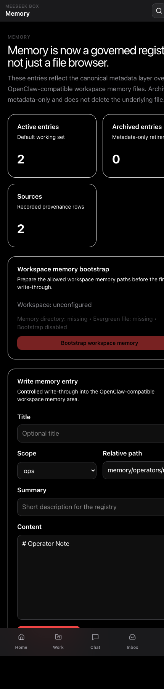

## 8. Agents

Purpose: runtime context and org hierarchy reference.

How it is used:

- Shows the top-level runtime contexts available to the system.
- Displays agent counts and hierarchical reporting structures within each context.
- Supports the rest of the product by giving `Chat`, `Work`, and related pickers a shared organizational vocabulary.

Important nuance:

- This screen reads more like a system map/reference surface than a daily operations surface.
- Even if it is used less frequently, it is important because it shapes context selection everywhere else.

Desktop:

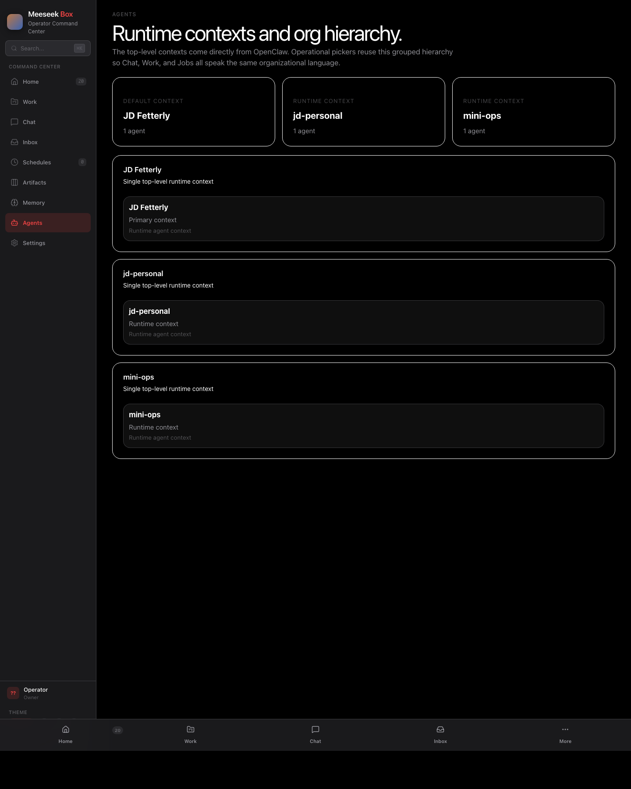

Mobile:

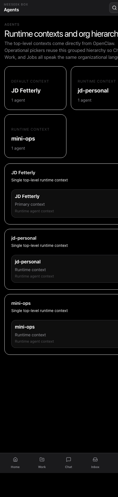

## 9. Settings

Purpose: personalization, demo-data reset, and shell configuration.

How it is used:

- Controls accent color, branding, operator name, icon/avatar behavior, and agent customization.
- Provides a reset path for realistic demo data.
- Acts as the setup/configuration surface rather than an operational workspace.

Important nuance:

- The presence of demo-data reset is important for staging, demos, and promptable design/testing workflows.
- This screen is visually quieter and more form-driven than the operational surfaces.

Desktop:

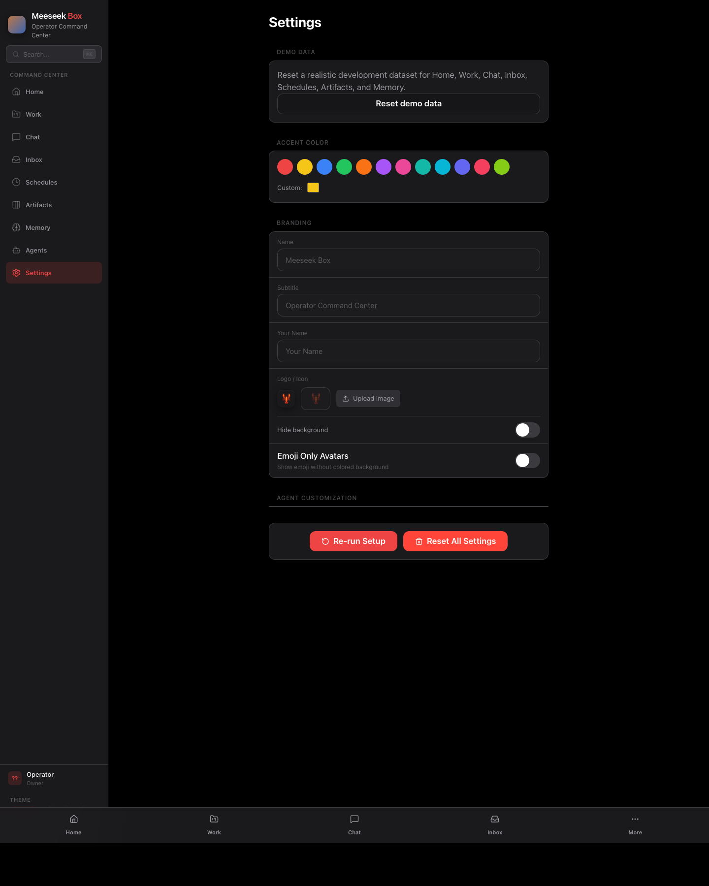

Mobile:

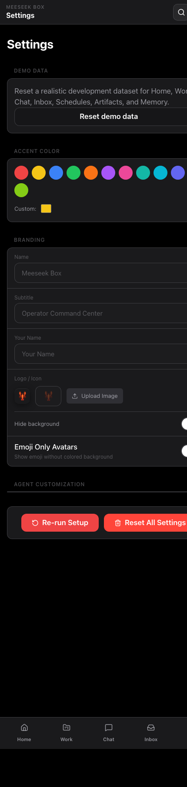

## Design Takeaways For Another LLM

- The product is organized around operational objects: work, conversations, inbox items, schedules, artifacts, memory entries, and agents.
- `Work`, `Chat`, and `Inbox` are the core action loop.
- `Home` is summary/triage, not the place where actions are primarily completed.
- `Schedules`, `Artifacts`, and `Memory` are specialized system-management surfaces with more registry semantics than consumer-app semantics.
- The desktop/responsive shell uses the same information model across viewport sizes, but the current production iPhone surface is a dedicated `/mobile` command shell.
- The UI language consistently emphasizes operational clarity over decorative interface patterns.

## Recommended Starting Point For UI Redesign Work

If another model needs a fast starting point, prioritize these screens in this order:

1. `Work`
2. `Inbox`
3. `Home`
4. `Chat`
5. `Schedules`

Those five together describe the core operating model of the product.

For current mobile redesign or QA work, start from `/mobile` and the Mac mini production runbook instead of these March 2026 mobile screenshots.
