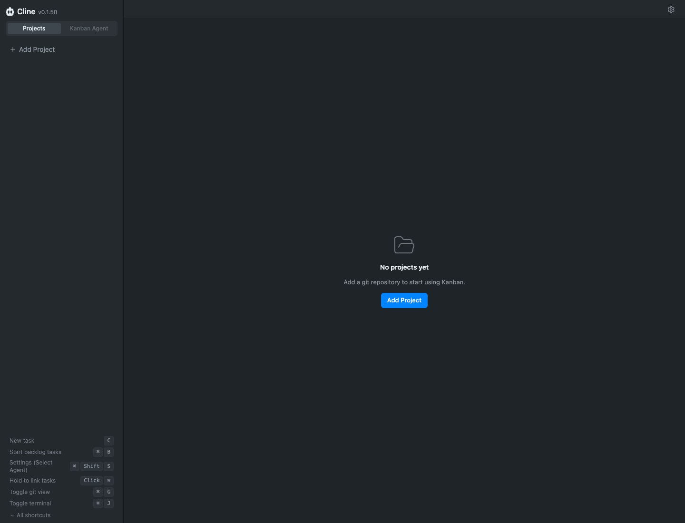
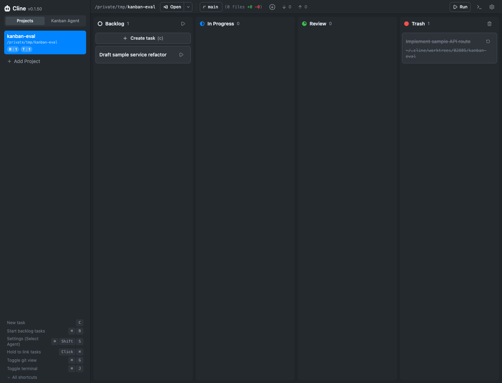
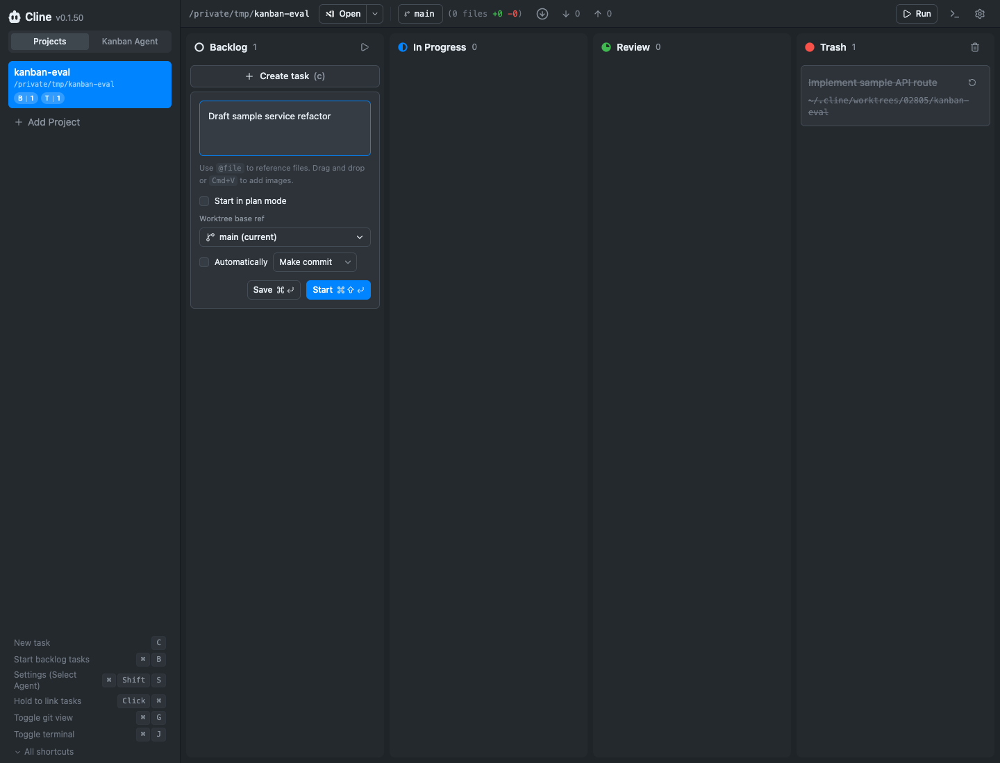
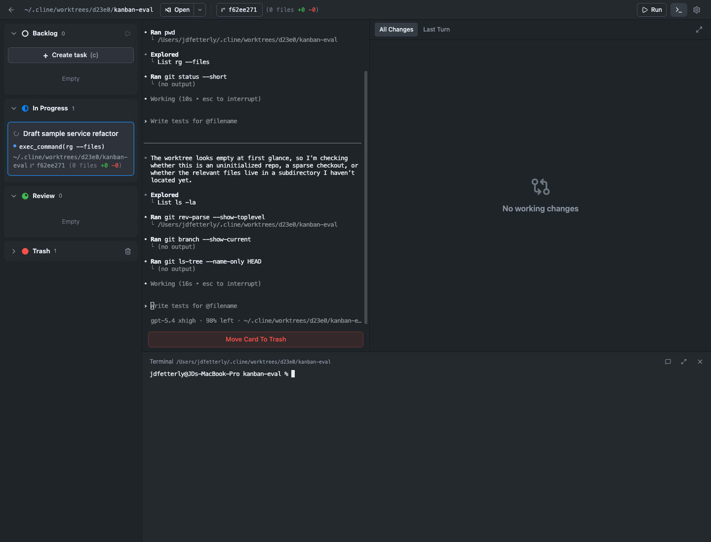

# Cline Kanban Findings and Impressions

- Artifact: `Findings and impressions reference`
- Project: `Meeseek Box`
- Status: `active`
- Last Updated: `2026-03-27`

This document captures the findings from investigating Cline Kanban plus my informed impressions after reading the public materials and using the local runtime. It is intended as source material for later synthesis by other models or planning passes.

It is not a requirements brief, implementation plan, or product decision document.

## Evidence and Investigation Method

### Sources Used

- Cline launch post: [Announcing Cline Kanban](https://cline.bot/blog/announcing-kanban)
- Cline marketing page: [Cline Kanban](https://cline.bot/kanban)
- Cline docs: [Overview](https://docs.cline.bot/kanban/overview), [Core Workflow](https://docs.cline.bot/kanban/core-workflow), [Features](https://docs.cline.bot/kanban/features)
- Local runtime inspection via the standalone `kanban` binary

### Local Runtime Notes

- `cline version` reported `2.11.0`
- `kanban -v` reported `0.1.50`
- The runtime was launched locally and inspected against a temporary git repo at `/private/tmp/kanban-eval`
- Runtime state was observed under `~/.cline/kanban`
- Task worktrees were observed under `~/.cline/worktrees`

### Investigation Labels

- `Observed`: directly verified from docs, marketing copy, runtime files, or hands-on UI inspection
- `Inferred`: likely true from the combination of observed evidence, but not directly proven end-to-end
- `Opinion / impression`: my judgment about what felt strong, weak, or especially revealing during the investigation

### Evidence Limits

- The investigation covered public materials plus a local single-user runtime walkthrough
- Team workflows, remote config gating, and extended real-task review cycles were not exercised end-to-end
- Some capabilities were verified only in docs, not through a complete local run

*Empty-state screenshot from an isolated local runtime with no projects added yet.*

## Product Summary

### Observed

- Cline Kanban is a terminal-launched kanban board that runs in the browser and is designed to orchestrate coding agents across git worktrees.
- Official docs describe it as "a kanban board for orchestrating coding agents in parallel using git worktrees."
- The launch post frames the product around reducing human attention overhead when many agents are running at once.
- `cline --kanban` is not the board itself; it launches the separate `kanban` runtime.
- The standalone runtime exposes its own CLI surface and browser app.
- Global runtime state was observed under `~/.cline/kanban/config.json` and `~/.cline/kanban/workspaces/index.json`.
- Per-project board state was observed under `~/.cline/kanban/workspaces/<workspaceId>/...`.
- Active task worktrees were observed under `~/.cline/worktrees/<taskId>/<workspace-folder>`.

### Inferred

- The board is intended to be a coordination layer on top of existing agent CLIs rather than a replacement for those agent runtimes.
- The product model is centered on repo-backed execution units rather than broad project management objects.

### Opinion / Impression

- The product reads less like a generic kanban app and more like a live orchestration shell for agent work.
- The board's identity is unusually tight. It is not trying to be a broad work management suite.

## Core Model and Workflow

### Main Objects and State Model

#### Observed

- `Project / workspace`: a git-backed repo opened into the runtime and tracked in the workspace index.
- `Task card`: a discrete unit of work shown on the board.
- `Lane state`: the live runtime used `Backlog`, `In Progress`, `Review`, and `Trash`.
- `Worktree`: an isolated git worktree created per active task.
- `Agent/runtime session`: an active task can show status text, terminal interaction, and session state.
- `Diff / review state`: the detail view exposes diff modes and, per docs, checkpoint-scoped diffs and inline comments.
- `Global settings`: runtime-wide settings were shown in `~/.cline/kanban/config.json`.
- `Project settings`: the UI displayed a project-scoped config path at `<project>/.cline/kanban/config.json`.

#### Inferred

- The task card is the dominant product object. Most of the system complexity is subordinate to card lifecycle.
- Project identity is real, but it mainly serves as the container for repo state, board state, and runtime controls.

### End-to-End Workflow

#### Observed in Docs and Marketing

1. Open Kanban from the terminal at the root of a git repo.
2. Add tasks manually or ask the sidebar chat agent to create and organize them.
3. Link dependent tasks.
4. Start a card.
5. Let Kanban create an ephemeral worktree and launch an agent session.
6. Monitor the card from the board.
7. Open the card to inspect terminal output and diffs.
8. Leave inline comments in the diff.
9. Commit or open a PR.
10. Move the card to trash to clean up the worktree.
11. Optionally resume later via resume ID.

#### Observed Hands-On

1. Launching the standalone runtime opened a browser board with an empty-state flow.
2. The empty state required adding a git-backed project before the board became useful.
3. After opening a temporary repo, the project appeared in a compact project header with counts.
4. A task could be created and edited inline on the board.
5. The inline task editor exposed:
   - prompt text
   - `Start in plan mode`
   - `Worktree base ref`
   - auto-review toggle and mode
6. Starting the task moved it from `Backlog` to `In Progress`.
7. The in-progress card displayed:
   - task title
   - status text such as `Thinking...`
   - worktree path
   - commit/ref information
   - change counts
8. Opening the active card transitioned from board view into a detail surface.
9. The detail surface showed:
   - terminal input and terminal pane
   - diff panel
   - `All Changes` and `Last Turn` controls
   - a move-to-trash control

*Populated board screenshot showing the project header, lanes, a new backlog card, and the retained trash lane.*

#### Inferred

- The core loop is intentionally short: define work, start work, inspect work, ship work, clean up.
- Much of the UX power comes from keeping those steps in a single tool instead of across terminal, git client, and browser tabs.

## Detailed Capability Inventory

### Project Handling

#### Observed

- Add project from empty state
- Project switcher in the header
- Project counts displayed in the project chip
- Project path shown in compact form
- Open-in-editor controls in the header
- Branch display and top-level repo status
- Per-project config path surfaced in settings
- Workspace index persisted in `~/.cline/kanban/workspaces/index.json`

#### Inferred

- The runtime is designed to manage more than one repo from a single installed binary and runtime state area.

### Board Interactions

#### Observed

- Empty-state onboarding
- Shortcut strip rendered directly in the sidebar
- `Create task` action on the board
- Lane counts
- Start-all-backlog control
- Card click to edit or inspect
- Board-to-detail transition

#### Observed in Docs

- Keyboard shortcut `C` for creating a task
- `Cmd/Ctrl + click` for linking cards

### Task Creation and Editing

#### Observed

- Inline editing rather than a heavy modal workflow
- Editable task prompt
- Plan-mode toggle
- Base-ref selector
- Auto-review toggle
- Auto-review mode selector
- Save and Start actions in the inline editor

#### Observed in Docs

- Sidebar chat can break work into multiple tasks
- Sidebar chat can link tasks and start work on the board

*Inline editing screenshot showing prompt editing, plan mode, base ref, and automatic review controls directly inside the board.*

### Dependency Handling

#### Observed in Docs

- Cards can be linked into dependency chains
- Dependent cards can start automatically after parent completion
- Chains can be combined with auto-commit for autonomous pipelines

#### Not Exercised Hands-On

- I did not link tasks manually or watch chained execution complete

### Task Execution

#### Observed

- Starting a card creates a worktree-backed execution context
- Active cards surface live status directly on the card
- In-progress cards display worktree path and change counts
- Active card detail includes terminal interaction

#### Observed in Docs

- Each task gets its own terminal and worktree
- Card surfaces latest agent message or tool call
- Multiple tasks can run in parallel without merge conflicts

### Worktree Behavior

#### Observed in Docs

- Ephemeral worktrees are created per task
- Worktrees are cleaned up when cards move to trash
- Gitignored dependencies such as `node_modules` can be symlinked
- Resume IDs can preserve continuity after trashing a card

#### Observed from Runtime Files and UI

- Task worktrees were created under `~/.cline/worktrees`
- Active card UI exposed the concrete worktree path

### Diff and Review Behavior

#### Observed

- Detail view included a diff pane
- The pane exposed `All Changes` and `Last Turn` controls
- In the inspected task, the diff pane showed `No working changes`

#### Observed in Docs

- Diff view supports checkpoint-scoped diffs
- Inline comments can be sent back to the agent
- Review flow includes `Commit` and `Open PR`
- Docs claim merge conflicts are handled intelligently during ship actions

#### Not Exercised Hands-On

- I did not run a task long enough to generate a meaningful diff
- I did not leave an inline comment or complete the commit/PR flow

### Git Controls

#### Observed

- Branch control in the header
- Fetch, pull, and push buttons
- Repo status counts visible near the branch

#### Observed in Docs

- Full git interface can browse commit history
- Branch switching is supported
- Git graph visualization is supported

### Runtime Settings

#### Observed

- Agent runtime selection UI
- Runtime choices included Cline, Claude Code, and OpenAI Codex
- Installed runtimes were visibly labeled in settings
- Bypass-permissions flag exposed in settings
- Git action prompt templates surfaced directly in settings
- Notification settings exposed in settings
- Script shortcuts section exposed in settings
- Distinct global and project config locations surfaced

#### Observed in Docs

- Auto-commit toggle
- Auto-PR toggle
- Script shortcuts
- Project path readability setting
- Remote config gating for teams/orgs

### Terminal Integration

#### Observed

- Terminal pane can be opened and closed from the detail surface
- Terminal pane shows the task worktree path
- Terminal input field is built into the interface
- Run controls are present in the interface

#### Inferred

- The terminal is not secondary decoration. It is one half of the active task surface.

*Active execution screenshot showing the board column context, task transcript, diff panel, and terminal pane together.*

## What Worked Especially Well

### Opinion / Impression

- The tightness of the product model is the biggest strength. One card corresponds to one live unit of agent work, and that makes the board immediately legible.
- Progressive disclosure is handled with unusual discipline. The board stays compact and scannable, while deeper controls only appear when a card becomes active or is explicitly opened.
- The project header carries a lot of useful state without feeling dense. Repo, branch, counts, open-in-editor behavior, and git controls all fit into a compact strip.
- Inline card editing worked especially well. It felt faster and lighter than opening a modal or separate form, and it kept the mental model anchored to the board.
- The transition from board card to active execution surface is strong. It feels like a natural zoom into the work rather than a jump to a different tool.
- Execution and review sit very close together. Terminal and diff live in the same flow, which reduces the sense of context switching.
- The empty-state onboarding is effective. It explains the minimum next step and relies on lightweight shortcut hints instead of a long tutorial.
- The UI feels calm because it avoids broad navigation and avoids multiplying object types. It stays centered on the few things the user actually needs to manage.

## What I Learned From Inspecting It

### Opinion / Impression

- The simplicity comes much more from the product model than from visual design alone. The interface is clean because the underlying mental model is narrow and coherent.
- The worktree system is not just a backend implementation detail. It is the structural reason the board can feel reliable while running parallel tasks.
- The docs explain the mechanics well, but the hands-on runtime made the interaction model clearer. Inline editing, board-to-detail flow, and the compactness of the active task surface stood out more in use than in documentation.
- The board feels intuitive because it gives the user one place to look for the current truth. The cards, project header, terminal pane, and diff pane are all different views of the same live unit of work.
- The marketing emphasis on attention management matches the product. After using it, that framing felt credible rather than decorative.
- The hands-on flow made clear that this is not a conventional project board with AI bolted on. It is closer to a coordination shell for task execution.
- The local runtime structure also clarified that the product separates global runtime installation from per-project board state cleanly, which matters for multi-repo use.

## Persistent Memory Findings

### Observed

- The board strongly represents operational state:
  - current lane
  - current task status
  - worktree path
  - branch/ref
  - diff state
  - resume IDs
  - runtime and project settings
- I did not observe a first-class board-level memory surface for persistent project context.
- I did not observe a visible place in the board for:
  - project brief
  - durable constraints
  - accepted decisions
  - learned preferences
  - persistent task context inherited across cards
- The persisted runtime files observed under `~/.cline/kanban/workspaces/...` appeared operational:
  - `board.json`
  - `sessions.json`
  - `meta.json`

### Inferred

- Cline Kanban appears to persist execution state and board state more clearly than semantic project understanding.
- Continuity mechanisms exist, but they appear operational rather than memory-oriented.
- Resume IDs preserve task continuation, but they do not appear to function as a visible project-memory layer.

### Opinion / Impression

- This was the clearest gap relative to how polished the orchestration layer feels.
- The board holds runtime context well. It did not visibly hold meaning in the same way.
- Said differently: it remembers what is running more clearly than it remembers why the work exists, what decisions led to it, or what future tasks should inherit from it.

## Apparent Boundaries of the Product

### Observed

- The runtime centers on git-backed coding work.
- The empty-state flow expects a git repository.
- Worktrees, diffs, commits, PRs, and git actions are first-class.
- Agent runtime settings are part of the primary product surface.

### Inferred

- The product is focused on coordinating coding-agent execution rather than generalized project management.
- The primary object is the execution-ready task, not a rich long-lived project context container.
- The product is designed to sit on top of existing coding agents, not replace them with its own monolithic experience.

### Opinion / Impression

- The boundaries are part of why the product feels clean.
- It feels intentionally specialized rather than broadly ambitious.

## Open Questions

- How strong is the sidebar chat flow in daily use relative to direct board manipulation? I verified the board surface much more than the sidebar chat orchestration loop.
- How effective is the inline diff commenting loop once a task has substantial real code changes? The UI and docs support it, but I did not exercise a full review cycle.
- How polished are the commit and PR handoff flows in real repositories with drift and conflicts? Docs claim intelligent handling, but I did not test it.
- How often do users rely on dependency linking versus simply starting cards manually? The feature is prominent in docs and marketing, but I did not observe real chained execution.
- Is there any deeper persistent-memory behavior available elsewhere in the broader Cline ecosystem that is not surfaced in Kanban itself? The Kanban surface did not show one directly.
- How much does the `Kanban Agent` entry point change the day-to-day experience? It was present in the runtime, but I did not fully exercise it.

## Sources

- [Announcing Cline Kanban](https://cline.bot/blog/announcing-kanban)
- [Cline Kanban marketing page](https://cline.bot/kanban)
- [Cline Kanban overview docs](https://docs.cline.bot/kanban/overview)
- [Cline Kanban core workflow docs](https://docs.cline.bot/kanban/core-workflow)
- [Cline Kanban features docs](https://docs.cline.bot/kanban/features)

### Local Versions and Runtime Notes

- `cline version`: `2.11.0`
- `kanban -v`: `0.1.50`
- Local runtime inspected via standalone `kanban` binary
- Temporary inspection repo: `/private/tmp/kanban-eval`
